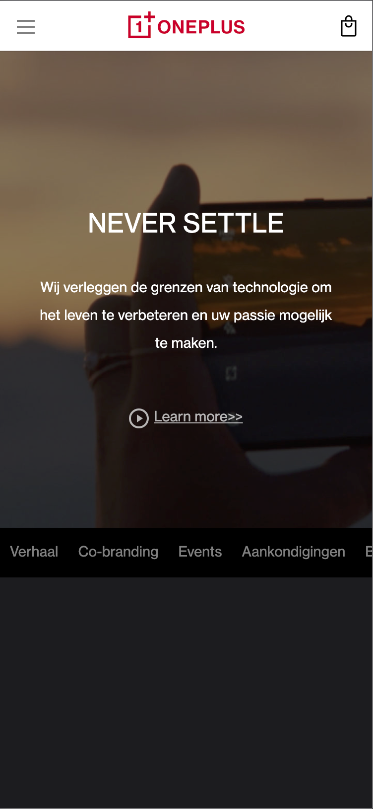

# Procesverslag
**Auteur:** -jouw naam-

Markdown cheat cheet: [Hulp bij het schrijven van Markdown](https://github.com/adam-p/markdown-here/wiki/Markdown-Cheatsheet). Nb. de standaardstructuur en de spartaanse opmaak zijn helemaal prima. Het gaat om de inhoud van je procesverslag. Besteedt de tijd voor pracht en praal aan je website.

## Bronnenlijst
1. menu icon: https://www.w3schools.com/howto/tryit.asp?filename=tryhow_css_menu_icon_js
2. text over image: https://www.w3schools.com/howto/tryit.asp?filename=tryhow_css_image_text
3. right arrow: https://www.w3schools.com/howto/howto_css_arrows.asp
4. Code gebruikt van de Oneplus website zelf 'object-fit:cover'

## Eindgesprek (week 7/8)

-dit ging goed & dit was lastig-

**Screenshot(s):**

-screenshot(s) van je eindresultaat-

## Voortgang 3 (week 6)

-same as voortgang 1-

## Voortgang 2 (week 5)

- ik heb alle background images in de css gezet waardor de tekst nu op de afbeelding komt. wel loop ik tegen nog wat dingen aan. Ik weet niet hoe 
ik de afbeelding meer uitgezoomed kan laten lijken(geen effect) net zoals op de website van oneplus. bijvoorbeeld bij de Oneplus buds en de referral program foto. Ook is het mij nog niet gelukt om de opinions van andere website in zo'n slider te zetten. -

## Voortgang 1 (week 3)

### Stand van zaken

- Ik heb een hambuger menu erin gezet en de afbeeldingen en de tekst op de afbeelding. hier ben ik aantal dagen flink op vast gelopen.
uiteindelijk was het zo simpel als ipv van e afbeelding in de html in de css te zetten! -

### Agenda voor meeting

-samen met je groepje opstellen-

| student 1      | student 2          | student 3    | student 4        |
| ---            | ---                | ---          | ---              |
| dit bespreken  | en dit             | en ik dit    | en dan ik dat    |
| an dat ook nog | dit als er tijd is | nog een punt | dit wil ik zeker |
| ...            | ...                | ...          | ...              |

### Verslag van meeting

-na afloop snel uitkomsten vastleggen-

## Breakdownschets (week 1)

*Breakdown schets van de homepagina van de OnePlus website.*

## Intake (week 1)
-uitwerken voor de kick-off werkgroep - begin van de eerste week-

**Je startniveau:** rood 

**Je focus:** surface plane

**Je opdracht - link naar de website die ik ga namaken:** https://www.oneplus.com/nl

**Screenshot(s) van de eerste pagina (small screen):**

**Screenshot(s) van de tweede pagina (small screen):**

