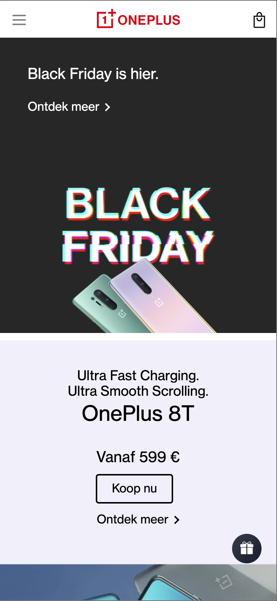

# Procesverslag
**Auteur:** Mirte Winter
Klas: 206
Studentnummer: 500817187
Vak: Front-end Development
Jaar: 2020-2021

Markdown cheat cheet: [Hulp bij het schrijven van Markdown](https://github.com/adam-p/markdown-here/wiki/Markdown-Cheatsheet). Nb. de standaardstructuur en de spartaanse opmaak zijn helemaal prima. Het gaat om de inhoud van je procesverslag. Besteedt de tijd voor pracht en praal aan je website.

## Bronnenlijst
1. Menu icon en footer icon: https://www.w3schools.com/howto/tryit.asp?filename=tryhow_css_menu_icon_js & https://www.youtube.com/watch?v=F-mvXKKoSCU&ab_channel=CodeSpot
2. Text over image: https://www.w3schools.com/howto/tryit.asp?filename=tryhow_css_image_text
3. Right arrow: https://www.w3schools.com/howto/howto_css_arrows.asp
4. Code gebruikt van de Oneplus website zelf 'object-fit:cover'
5. Code voor de testimonials: https://codepen.io/maheshambure21/pen/qZZrxy?editors=1100
6. Nieuwsbrief: https://www.w3schools.com/tags/tag_input.asp
7. Footer menu: https://www.w3schools.com/howto/howto_js_collapsible.asp , https://www.w3schools.com/howto/howto_js_dropdown.asp
8. focus weg te halen bij slider testimonial: https://stackoverflow.com/questions/3015523/remove-or-disable-focus-border-of-browser-via-javascript
9. Hulp steun voor flexbox elementen: https://css-tricks.com/snippets/css/a-guide-to-flexbox/
10. Array index hulp: https://developer.mozilla.org/nl/docs/Web/JavaScript/Reference/Global_Objects/Array/findIndex & https://developer.mozilla.org/en-US/docs/Web/JavaScript/Reference/Global_Objects/Array/indexOf
11. lijntje footer: https://www.w3schools.com/howto/howto_css_style_hr.asp
12. mailto: https://www.handleidinghtml.nl/html/hyperlinks/hyperlinks09.html
13. https://www.w3schools.com/cssref/pr_dim_line-height.asp 
14. https://codepen.io/SJdV/pen/gwqgZb 
15. index . html in logo link: https://stackoverflow.com/questions/39686111/link-my-logo-to-homepage/39686201
16. input afbeelding erin: https://stackoverflow.com/questions/917610/put-icon-inside-input-element-in-a-form
17. {} https://stackoverflow.com/questions/12097851/difference-between-var-and-var
18. Object keys https://developer.mozilla.org/en-US/docs/Web/JavaScript/Reference/Global_Objects/Object/keys & https://www.geeksforgeeks.org/object-keys-javascript/ & https://appdividend.com/2018/12/27/javascript-object-keys-example-object-keys-tutorial/ & https://www.youtube.com/watch?v=VmicKaGcs5g#:~:text=Javascript%20Object%20keys()%20is,found%20directly%20upon%20the%20object. & https://www.youtube.com/watch?v=4uVwGw317QM&t=5s
19.  https://developer.mozilla.org/en-US/docs/Web/JavaScript/Reference/Global_Objects/Array/forEach
20. https://khaledkzy.github.io/pixel-vh-vw-converter/ & https://www.w3schools.com/tags/ref_pxtoemconversion.asp
21. java script extra's : https://www.youtube.com/watch?v=yytscwxx1pk & https://www.youtube.com/watch?v=urol_SD1wz4&t=538s & https://www.youtube.com/watch?v=O9l75KOB2pE&t=121s & https://www.youtube.com/watch?v=1iS0r238G4g & https://www.youtube.com/watch?v=acuYmzY6XOg&t=267s

## Eindgesprek (week 7/8)

-dit ging goed: het maken van de blokken op de home pagina(lees mijn voortgang 1 voor meer over de blokken op de homepagina)  & dit was lastig: Footer icon wilde in ht begin niet fijn plaatsen na een korte pauze ben ik weer even in de flexbox gedoken en ben ik eruit gekomen :)
 slideshow testimonials: ik vond dit erg lastig , ik heb hiervoor een bron gebruikt die in mijn bronnen terug te vinden is. deze heb i zo aanpast dat het matchte met mijn de OnePlus website. Tevens had ik ook moeite met de afbeeldingen plaatsen in de navigatie meny en op de vind een winkel pagina had ik ook moeite met de afbeelding in de input ik heb hier dan ook een bron voor gebruikt (staat vermeld in bronvermlding)L

Als ik meer tijd had gehad had ik graag nog de footer beter willen maken, de kleine lettertjes zijn niet perfect, had ik graag een overlay willen maken wnnwanneerr je een postcode invult in de 'vind een winkel' pagina en had ik graag nog het aanmeld icoon beter wilen namaken. Overall ben ik best tevreden dat ik dit heb neergzet. Eigenljk niet verwacht van mezelf. :) YEEY 

 Ik vond het erg leuk en frusterend om deze site na te maken maar heb veel geleerd over flexbox en hoe je hamburger menu's kan manipuleren tijdens het maken van deze website :)   

 Part 2: 
 De code opruimen ging goed maar duurde erg lang, vrij veel machine werk. aantal dagen flink daarmee aan de slag geweest vervolgens nog wat andere punten van de feedback aangepakt. en poh he soms zag ik even het licht niet meer. maar na wat raadplegen van klasgenoten en een boel video's kijken voor uitleg ging dit steeds beter en kwam er 
 licht te voorschijn :).

# screenshot(s) van je eindresultaat
## Homepagine screenshot:
    
## Menu screenshot:
    
## Vind een winkel pagina screenshot:
    

## Voortgang 3 (week 6)

- Tijdens de derde voortgangs gesprek was ik nog niet heel veel verder gekomen dan voortgang 2 omdat ik mij gefocused op andere vakken/deadlines.-

## Voortgang 2 (week 5)

- ik heb alle background images in de css gezet waardor de tekst nu op de afbeelding komt. wel loop ik tegen nog wat dingen aan. Ik weet niet hoe 
ik de afbeelding meer uitgezoomed kan laten lijken(geen effect) net zoals op de website van oneplus. bijvoorbeeld bij de Oneplus buds en de referral program foto. Ook is het mij nog niet gelukt om de opinions van andere website in zo'n slider te zetten. -

## Voortgang 1 (week 3)

### Stand van zaken

- Ik heb een hambuger menu erin gezet en de afbeeldingen en de tekst op de afbeelding. hier ben ik aantal dagen flink op vast gelopen.
uiteindelijk was het zo simpel als ipv van e afbeelding in de html in de css te zetten! -

### Agenda voor meeting

-samen met je groepje opstellen-

| student 1      | student 2          | student 3    | student 4        |
| ---            | ---                | ---          | ---              |
| dit bespreken  | en dit             | en ik dit    | en dan ik dat    |
| an dat ook nog | dit als er tijd is | nog een punt | dit wil ik zeker |
| ...            | ...                | ...          | ...              |

### Verslag van meeting

-na afloop snel uitkomsten vastleggen-

## Breakdownschets (week 1)

*Breakdown schets van de homepagina van de OnePlus website.*

## Intake (week 1)
-uitwerken voor de kick-off werkgroep - begin van de eerste week-

**Je startniveau:** rood 

**Je focus:** surface plane

**Je opdracht - link naar de website die ik ga namaken:** https://www.oneplus.com/nl

**Screenshot(s) van de eerste pagina (small screen): Home pagina

**Screenshot(s) van de tweede pagina (small screen): Vind winkels pagina

